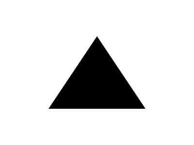
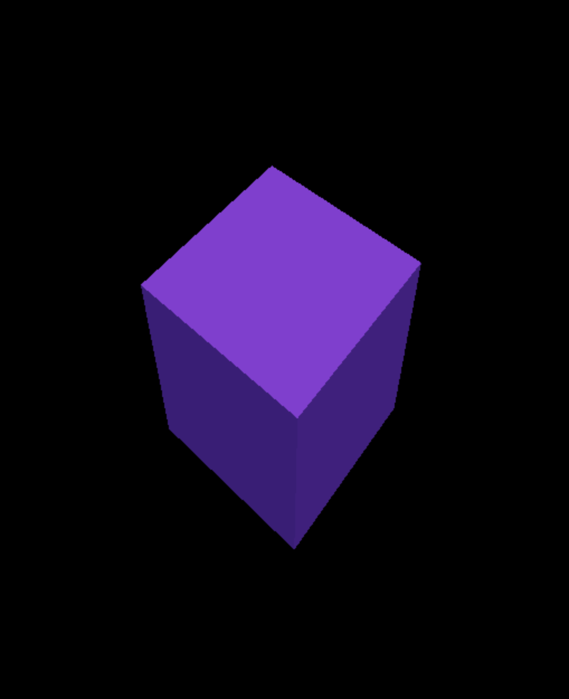
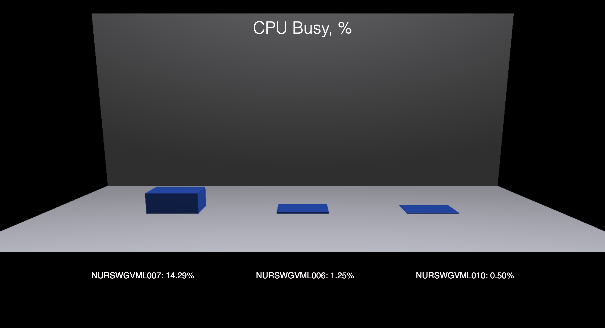
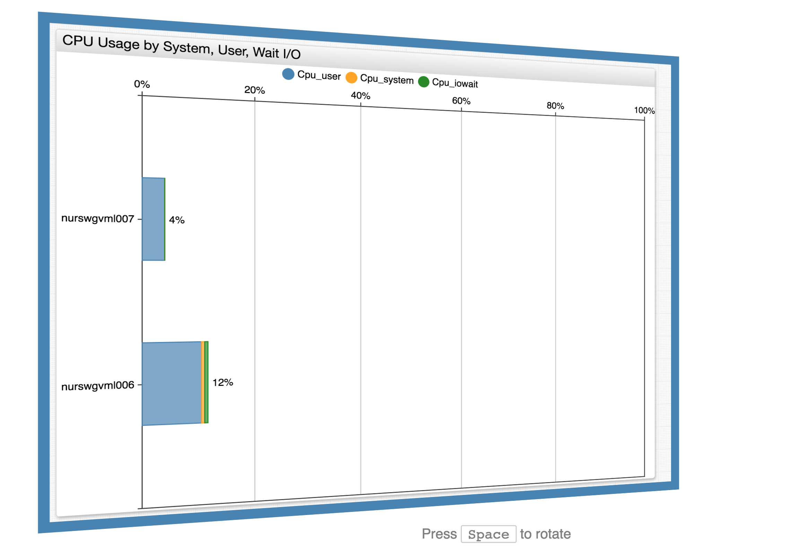

# WebGL: Web-based Graphics Library
### 3D Image Design Without Plugins

> Examples in this article use ES6 syntax and Fetch API, which are not supported in Internet Explorer.

## Introduction
Drawing in Web:
* Adobe Flash / MS Silverlight
  + Requires plugin

* SVG:
  + Creates DOM elements, which handles events;
  + Declarative creation and styling;
  + May be slow;
  + Not designed for 3D graphics;
  + As HTML, works fine with fonts, but cannot manage text layout.

* Canvas 2D API:
  + Imperative 2D rendering;
  + Rendering does not affect DOM;
  + Can provide raw frame buffer;
  + Can draw text like SVG, but text drawing must be controlled by user (e.g. to replace one text line with another, you need manually clean the old line space and put the new one in its place, or redraw the whole scene);
  + User interaction (mouse events etc.) must be implemented manually or with some framework.

* WebGL

## Key Concepts

* Based on OpenGL ES 2.0, (WebGL2 on OpenGL ES 3.0);
* GPU-computation principle: execute simple commands for a lot of data in parallel;
* GPU-accelerated rendering using shaders: small programs for GPU (written in GLSL). WebGL supports 2 types of shaders: vertex shaders and fragment shaders.

Pipeline (simplified):


> https://kaidu1982.github.io/2013-jco-webgl/reveal.js-master/img/webgl_rendering_pipeline.png

Simplicity causes a reduced number of primitives to be rendered: WebGL can draw lines, points and triangles (polygons), but it can't draw cubes, spheres, circles etc.). To display other figures, they must be represented as a polygonal model.


> http://caig.cs.nctu.edu.tw/course/CG2007/images/ex1_wireframe.jpg

To display this teapot, we need to: 
1. Initialize WebGL context;
2. Create array of vertices for the teapot model;
3. Create array of indices for the vertices of each polygon;
4. Create vertex and fragment shaders;
5. Link shaders to shader program;
6. Create array buffer and pass it vertex data;
7. Create index buffer and pass it indices;
8. Connect shader attribute variables with data representation;
9. Draw! 

## Limitations
1. Hard to learn (especially at low-level).
2. Very hard to render text.
3. Can not render Web content (DOM elements, iframes, etc.).
4. Requires lots of platform resources
5. Context loss (required for proper handling)

## Browser Support

### WebGL
* IE 11+
* Edge
* Chrome 8+
* Firefox 4+
* Opera 12.1+
* Safari 5.1+

### WebGL2 
* Chrome 56+
* Firefox 51+
* Opera 43+
* _Safari 10.1+ (with flag)_


## Hello World

A traditional triangle example. 
[Open in Playground](https://stackblitz.com/edit/axibase-workshop-webgl-triangle)

[View on apps.axibase.com](https://apps.axibase.com/webgl/triangle)



### Context initialization
_index.html_
```html
<body>
    <canvas width="400" height="300"></canvas>
    <script src="triangle.js"></script>
</body>
```
_triangle.js_
```javascript
let canvas = document.querySelector("canvas");
let gl = canvas.getContext("webgl");
```

### Fill background
_triangle.js_
```javascript
gl.clearColor(0.99, 0.84, 0.20, 1.0); // Orange
gl.clear(gl.COLOR_BUFFER_BIT);
```

### Create Vertex Shader

The vertex shader transforms model vertices positions, e.g. to scale, rotate, or move the model. Since the vertex shader is the first programmable shader in the pipeline, only this shader can handle attribute variables. Thus, vertex position and color are passed to this shader, set the final vertex position to the given value and move the color to the fragment shader.

Data can be passed to shaders through attributes and uniforms.

```glsl
// Attributed used to pass data into shader
attribute vec2 position;
attribute vec3 color;

// This variable provides vertex color to fragment shader
varying vec3 vcolor;
void main()
{
    gl_Position = vec4(position,0.0,1.0);
    vcolor = color;
}
```

### Create Fragment Shader

Fragment shaders calculate the color for each vertex. We just pass the argument to output.

```glsl
// Set medium precision (required in WebGL 1)
precision mediump float;
varying vec3 vcolor;
void main() {
  gl_FragColor = vec4(vcolor, 1.0);  
}
```

### Shader compilation and program linkage
> Error handling is skipped

```js
let vertexShader = gl.createShader(gl.VERTEX_SHADER);
gl.shaderSource(vertexShader, vertexShaderSrc);
gl.compileShader(vertexShader)

let fragmentShader = gl.createShader(gl.FRAGMENT_SHADER);
gl.shaderSource(fragmentShader, fragmentShaderSrc);
gl.compileShader(fragmentShader);

let prog = gl.createProgram();
gl.attachShader(prog, vertexShader);
gl.attachShader(prog, fragmentShader);
gl.linkProgram(prog);
// Once we linked program, we no longer need these shaders
gl.deleteShader(vertexShader);
gl.deleteShader(fragmentShader);
```

### Buffer Initialization
Passing data to and from the GPU is expensive, so we need to pass as much data as we can in as few trips as possible. We pass position and color info as a plaintext array through the _buffer object_ `vbo`. To tell the GPU which attribute is located at buffer, we call `gl.vertexAttribPointer`, passing the attribute location index from program, count, and type of attribute type vector (position is `vec2` and color is `vec3`), normalization flag, size of structure and field offset. 

We are drawing a single triangle, so we don't need index buffer.

```js
let vertices = new Float32Array([
//  Position          Color
//  x     y        r    g    b
  -0.5, -0.5,     1.0, 0.0, 0.0,
   0.5, -0.5,     0.0, 1.0, 0.0,
   0  ,  0.5,     0.0, 0.0, 1.0,
]);

const f32Size = vertices.BYTES_PER_ELEMENT;

let vbo = gl.createBuffer();
gl.bindBuffer(gl.ARRAY_BUFFER, vbo);
gl.bufferData(gl.ARRAY_BUFFER, vertices, gl.STATIC_DRAW);

let posLoc = gl.getAttribLocation(prog, "position");
let colorLoc = gl.getAttribLocation(prog, "color");
gl.enableVertexAttribArray(posLoc);
gl.vertexAttribPointer(posLoc, 2, gl.FLOAT, false, 5 * f32Size, 0);
gl.enableVertexAttribArray(colorLoc);
gl.vertexAttribPointer(colorLoc, 3, gl.FLOAT, false, 5 * f32Size, 2 * f32Size);
```

### Draw
```js
gl.useProgram(prog);
gl.drawArrays(gl.TRIANGLES, 0, 3);
```

### Full code

_index.html_
```html
<canvas width="400" height="300"></canvas>
<script src="index.js"></script>
```

_index.js_
```js
let canvas = document.querySelector("canvas");
let gl = canvas.getContext("webgl");

gl.clearColor(1.0, 1.0, 1.0, 1.0);
gl.clear(gl.COLOR_BUFFER_BIT);


let vertexShaderSrc = `
attribute vec2 position;
void main()
{
  gl_Position = vec4(position,0.0,1.0);
}`;

let fragmentShaderSrc = `
precision mediump float;
void main() {
  gl_FragColor = vec4(0.0, 0.0, 0.0, 1.0);  
}`;


let vertexShader = gl.createShader(gl.VERTEX_SHADER);
gl.shaderSource(vertexShader, vertexShaderSrc);
gl.compileShader(vertexShader)

let fragmentShader = gl.createShader(gl.FRAGMENT_SHADER);
gl.shaderSource(fragmentShader, fragmentShaderSrc);
gl.compileShader(fragmentShader);

let prog = gl.createProgram();
gl.attachShader(prog, vertexShader);
gl.attachShader(prog, fragmentShader);
gl.linkProgram(prog);
gl.deleteShader(vertexShader);
gl.deleteShader(fragmentShader);

let vertices = new Float32Array([
  //  x     y  
  -0.5, -0.5,
  0.5,  -0.5,
  0,    0.5,
]);

const f32Size = vertices.BYTES_PER_ELEMENT;

let vbo = gl.createBuffer();
let posLoc = gl.getAttribLocation(prog, "position");
gl.bindBuffer(gl.ARRAY_BUFFER, vbo);
gl.bufferData(gl.ARRAY_BUFFER, vertices, gl.STATIC_DRAW);
gl.enableVertexAttribArray(posLoc);
gl.vertexAttribPointer(posLoc, 2, gl.FLOAT, false, 0, 0);

gl.useProgram(prog);
gl.drawArrays(gl.TRIANGLES, 0, 3);

gl.deleteBuffer(vbo);
gl.deleteProgram(prog)
```


## THREE.js

Drawing to WebGL can be simplified, using a rendering framework, like [THREE.js](https://threejs.org)

Simple rotating cube example with THREE.js

[View on apps.axibase.com](https://apps.axibase.com/webgl/cube)

[Open in Playground](https://stackblitz.com/edit/axibase-workshop-threejs-cube)



```js
let scene = new THREE.Scene();

let renderer = new THREE.WebGLRenderer();
renderer.setSize(window.innerWidth, window.innerHeight);
document.body.appendChild(renderer.domElement);

// Add purple cube
let cubeGeometry = new THREE.BoxGeometry(2, 2, 2);
let cubeMaterial = new THREE.MeshPhongMaterial({ color: 0x7733ee });
let cube = new THREE.Mesh(cubeGeometry, cubeMaterial);
scene.add(cube);

// Add lights
let hemiLight = new THREE.HemisphereLight(0xdedede, 0x101010, 1);
scene.add(hemiLight);
let ambLight = new THREE.AmbientLight(0x303030);
scene.add(ambLight);

// Add camera
let camera = new THREE.PerspectiveCamera();
camera.position.z = 7;

function draw() {
  // Schedule next frame
  requestAnimationFrame(draw);
  renderer.render(scene, camera);
  // rotate cube
  cube.rotation.x += 0.03;
  cube.rotation.y += 0.03;
}

draw();
```

### 3d charts with THREE.js

[View on apps.axibase.com](https://apps.axibase.com/webgl/threegl_chart)

[Open in Playground](https://stackblitz.com/edit/axibase-workshop-threejs-barchart)



```html
<!DOCTYPE html>
<html>
<head>
    <meta charset="UTF-8">
    <meta name="viewport" content="width=device-width, initial-scale=1.0">
    <title>THREE.js example</title>
    <style>
        body {
            margin: 0;
            padding: 0;
            overflow: hidden;
            font-size: 20px;
            font-family: sans-serif;
            color: snow;
        }

        h1 {
            position: absolute;
            top: 24px;
            font-weight: 300;
            width: 100%;
            text-align: center;
        }

        #description {
            position: absolute;
            bottom: 16%;
            justify-content: space-between;
            width: 80%;
            left: 10%;
            text-align: center;
            z-index: 100;
            text-transform: uppercase;
            display: flex;
        }

        #description > * {
            flex-grow: 1;
        }
    </style>
</head>
<body>
    <h1>CPU Busy, %</h1>
    <div id="description"></div>
    <script src="three.min.js"></script>
    <script src="barchart.js"></script>
</body>
</html>
```

4. Create `barchart.js` file.

```javascript
// Get CPU busy data from ATSD
// Query ATSD Series
let loadAtsdCpuBusyData = fetch("https://apps.axibase.com/api/v1/series/query", {
    method: "POST",
    body: JSON.stringify([{
        startDate: new Date(Date.now() - 60 * 60 * 1000).toISOString(),
        endDate:   new Date().toISOString(),
        limit: 1,
        direction: "DESC",
        entity: "nurswgvml0*",
        metric: "cpu_busy"
    }])
})
// ... read it as json file
.then(resp => resp.json())
// ... and select required fields 
.then(resp => resp.map(series => ({
    // Select entity name and last value
    entity: series.entity,
    value: series.data[0].v,
})));

// Initialize graph scene and renderer
let scene = new THREE.Scene();
let renderer = new THREE.WebGLRenderer();

renderer.setSize(window.innerWidth, window.innerHeight);
document.body.appendChild(renderer.domElement);

// Create camera
let camera = new THREE.PerspectiveCamera();
camera.position.z = 3;
camera.position.y = -10;
camera.rotation.x = 1.4;

// Create chart ground plane
let groundGeometry = new THREE.PlaneGeometry(8, 6);
let groundMaterial = new THREE.MeshPhongMaterial({color: 0xFAFAFA});
let ground = new THREE.Mesh(groundGeometry, groundMaterial);
scene.add(ground);

// Create chart background plane
let bg = ground.clone();
bg.rotation.x = Math.PI / 2;
bg.position.y = 3;
bg.position.z = 3;
scene.add(bg);

// Initialize scene lights
let light = new THREE.HemisphereLight(0xEEEEFF, 0x303030, 1);
let pointLight = new THREE.PointLight(0xEEEEFF,1, 16);
pointLight.position.z = 10;
pointLight.position.y = -10;
pointLight.rotation.x = 1.2;
scene.add(light);
scene.add(pointLight);

// Get label container
let description = document.querySelector("#description");

loadAtsdCpuBusyData.then(data => {
    let col = 0;
    description.innerHTML = "";
    // Create columns for series
    for (let series of data) {
        let value = series.value / 100 * 4;
        let columnGeometry = new THREE.BoxGeometry(0.8, 0.8, value);
        let columnMaterial = new THREE.MeshPhongMaterial({color: 0x3366EE});
        let column = new THREE.Mesh(columnGeometry, columnMaterial);
        // By default column will be half below the plane, so we lift it
        column.position.z = value / 2;
        column.position.x = (col * 2 + 1) - 3;
        col++;
        scene.add(column);

        // Draw text labels for columns
        let label = document.createElement("div");
        label.textContent = `${series.entity}: ${series.value.toFixed(2)}%`;
        description.appendChild(label);
    }
    renderer.render(scene, camera);
})
```

### Portal gallery with THREE.js CSS3DRenderer


[View on apps.axibase.com](https://apps.axibase.com/webgl/threegl_gallery)



WebGL does not support HTML rendering, but with THREE.js we can work with DOM objects as if they were scene objects.

```javascript

// Initialize graph scene
let scene = new THREE.Scene();
let renderer = new THREE.CSS3DRenderer();
renderer.setSize(window.innerWidth, window.innerHeight);
document.body.appendChild(renderer.domElement);

// Create camera
let camera = new THREE.PerspectiveCamera();

function createPortalView(portalId, revision, position, angle) {
    let pageWrapper = document.createElement("div");
    pageWrapper.className = "page-wrapper";
    let iframe = document.createElement("iframe");
    iframe.src = `https://apps.axibase.com/chartlab/portal/?id=${portalId}&v=${revision}&theme=default&dataSource=default`;
    pageWrapper.appendChild(iframe);

    let object = new THREE.CSS3DObject(pageWrapper);
    object.position.set(...position);
    object.rotation.y = Math.PI + angle;
    return object;
};

// Add portal views
scene.add(createPortalView("8fe65e1b", 2, [0, 0, 640], 0));
scene.add(createPortalView("71546547", 2, [640, 0, 0], Math.PI / 2));
scene.add(createPortalView("12c2c970", 1, [0, 0, -640], Math.PI));
scene.add(createPortalView("cdb8bc6c", 1, [-640, 0, 0], - Math.PI / 2));
renderer.render(scene, camera);

// Initialize rotation control

let rotating = false;
function rotate() {
    if (rotating) {
        requestAnimationFrame(rotate);
    }
    const speed = 0.02;
    camera.rotation.y -= speed; // clockwise
    camera.rotation.y %= 2 * Math.PI;
    renderer.render(scene, camera);
}

document.addEventListener("keypress", (e) => {
    if (e.key === ' ') {
        if (!rotating) {
            rotating = true;
            rotate();
        }
    }
});

document.addEventListener("keyup", (e) => {
    if (e.key === ' ') {
        rotating = false;
    }
});
```

## Cesium
[https://cesiumjs.org/](https://cesiumjs.org/)

Provides interactive globe for data visualization. Supports time-based data rendering, different surface map systems (Bing, OpenStreetMap), data based 2D and 3D entity rendering.

### Geospatial data with Cesium

[View on apps.axibase.com](https://apps.axibase.com/webgl/cesium)


```javascript
let atsdDataLoaded = loadTemperatureData();
let viewer = new Cesium.Viewer('app', {
    timeline: false,
    imageryProvider: Cesium.createOpenStreetMapImageryProvider(),
});

atsdDataLoaded.then(stations => {
    for (let { name, temperature, lat, long } of stations) {
        let color = Cesium.Color[temperature > 30 ? "RED" : "GREEN"];
        viewer.entities.add({
            name: `Temperature of ${name}: ${temperature.toFixed()} (℃)`,
            position: Cesium.Cartesian3.fromDegrees(long, lat, 10000),
            cylinder: {
                length: temperature * 10000.0,
                topRadius: 10000.0,
                bottomRadius: 10000.0,
                material: color.withAlpha(0.8),
                outline: false
            }
        });
    }
    viewer.zoomTo(viewer.entities);
});

function loadTemperatureData() {
    let payload = [{
        startDate: "2016-01-01T00:00:00Z",
        endDate: "2017-01-01T00:00:00Z",
        entity: "*",
        metric: "pvout.temperature",
        limit: 1,
        direction: "DESC"
        addMeta: true
    }];

    return fetch("https://apps.axibase.com/api/v1/series/query", {
        method: "POST",
        body: JSON.stringify(payload)
    })
    .then(resp => resp.json())
    .then(data => data.map(entry => {
        return {
            name: entry.meta.entity.tags.alias,
            lat: +entry.meta.entity.tags.latitude,
            long: +entry.meta.entity.tags.longitude,
            temperature: entry.data[0].v,
        }
    }))
    .then(data => data.filter(({ lat }) => !isNaN(lat)));
}
```
